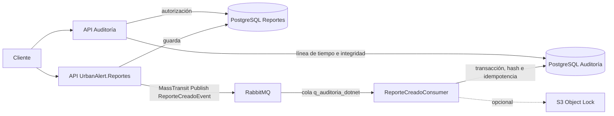

# Auditoría del flujo .NET

## Alcance actual

`UrbanAlert.Auditoria` es un consumidor MassTransit y una API de consulta. Consume el contrato tipado `Application.Reportes.Eventos.ReporteCreadoEvent` publicado por `UrbanAlert.Reportes`. No consulta ni consume servicios externos al backend .NET.

El único evento que Reportes publica hoy es la creación. Los handlers de cambio de estado, nivel de emergencia, asignación de responsable, rechazo y eliminación no publican eventos; por tanto, Auditoría no puede reconstruir esas operaciones leyendo la fila actual. En el workspace tampoco hay un productor Geoespacial .NET que publique un contrato de eventos para este consumidor.

## Flujo implementado

MassTransit enlaza `q_auditoria_dotnet` al exchange del tipo `ReporteCreadoEvent`. El consumidor normaliza el mensaje así:

| Registro de auditoría | Campo de Reportes .NET |
| --- | --- |
| `eventId` | `IdEvento` |
| `eventType` | Constante `reporte.creado` |
| `version` | `1` |
| `occurredAt` | `Reporte.Fecha` |
| `correlationId` | `ConsumeContext.CorrelationId`; si no viene, `null` |
| `reportId` | `Reporte.Id` |
| `data.actorId` | `Reporte.IdUsuario` |
| `data.idCoordenada` | `Reporte.IdCoordenada` |
| `data.estado` | `Reporte.Estado` como texto |

No se inventan municipio, latitud/longitud, categoría ni correlación. Esos valores no forman parte del mensaje actual. Los fallos al persistir o archivar se reintentan con la política MassTransit configurada; `eventId` hace idempotente la escritura.

## API y autorización

- `GET /auditoria/reportes/{reportId}?limit=100&cursor=0` devuelve la línea de tiempo ascendente y paginada.
- `GET /auditoria/reportes/{reportId}/integridad` recorre la cadena completa y solo permite gestor/admin.
- `GET /health` informa disponibilidad del proceso.

La API requiere JWT Cognito y la clave compartida del gateway. Consulta la tabla PostgreSQL `"Reportes"` por `"Id"`: ciudadano se valida contra `"IdUsuario"`, gestor contra `"IdResponsable"` y admin puede consultar cualquier reporte. El modelo actual no tiene tabla de usuarios ni municipio, por lo que el rol se toma de los claims y no se puede aplicar autorización municipal.

El `CrearReporteHandler` genera actualmente un `IdUsuario` aleatorio por reporte y no recibe identidad autenticada. Por ello, el filtro de propietario no coincidirá con el `sub` del ciudadano hasta que Reportes guarde su identidad real.

## Persistencia e integridad

El almacén PostgreSQL separado tiene:

- `audit_events`: una fila por `eventId`, secuencia global, tipo/versión, fecha, `report_id`, actor, payload JSONB, hash anterior y hash del evento. `correlation_id` admite `NULL` porque el mensaje actual no la garantiza.
- `audit_chain_state`: una única fila con la cabeza de la cadena; inicia con 64 ceros.

La escritura bloquea la fila de estado con `SELECT ... FOR UPDATE`, detecta reentregas por `eventId`, inserta el payload y actualiza la cabeza en una misma transacción. El hash SHA-256 se calcula sobre el JSON canónico del evento y el hash anterior. La tabla de eventos rechaza `UPDATE`, `DELETE` y `TRUNCATE`; el rol escritor no puede modificar las filas ya guardadas y el rol lector solo consulta.

Aplicar `database/001_audit_store.sql` como administrador tanto en una base nueva como existente: además de crear las tablas y triggers, hace nullable `correlation_id` en instalaciones previas.

## Archivo S3 opcional

Si `AuditArchive:Bucket` está configurado, tras persistir en PostgreSQL el servicio busca `events/{yyyy-MM-dd}/{eventId}.json`. Si no existe, guarda el evento, `previousHash` y `hash` con Object Lock `COMPLIANCE`, con retención predeterminada de 2555 días. El bucket debe tener Object Lock habilitado y el rol requiere permisos de lectura de metadatos y escritura con retención. Sin bucket, el archivado no se ejecuta.

Si S3 falla después del commit en PostgreSQL, MassTransit reintenta el mensaje. La deduplicación evita una segunda fila y el reintento vuelve a intentar el archivo. S3 es respaldo inmutable; PostgreSQL sigue siendo el origen de las consultas.

## Pendiente en Reportes .NET

Para auditar el ciclo completo, Reportes debe publicar eventos para cada transición y operación relevante. Estos deben incluir un `eventId` estable, `reportId`, `occurredAt`, actor y `CorrelationId` propagado desde la solicitud. La publicación actual se hace después de guardar el reporte y no usa outbox, así que una caída del broker puede dejar el reporte creado sin evento.

El siguiente paso recomendado es incorporar outbox transaccional en Reportes y contratos MassTransit para cambios de estado, asignación, nivel, rechazo y eliminación. Si luego existe un productor Geoespacial .NET, se acuerda su contrato y se registra un consumidor correspondiente en Auditoría. No se infieren eventos desde el estado final.

## Configuración

Las cadenas `AuditWriter`, `AuditReader` y `CorePostgres`, Cognito, gateway, RabbitMQ y S3 se detallan en el `README.md` de este proyecto. El consumidor usa `RabbitMq:Queue=q_auditoria_dotnet` y el binding tipado generado por MassTransit.
